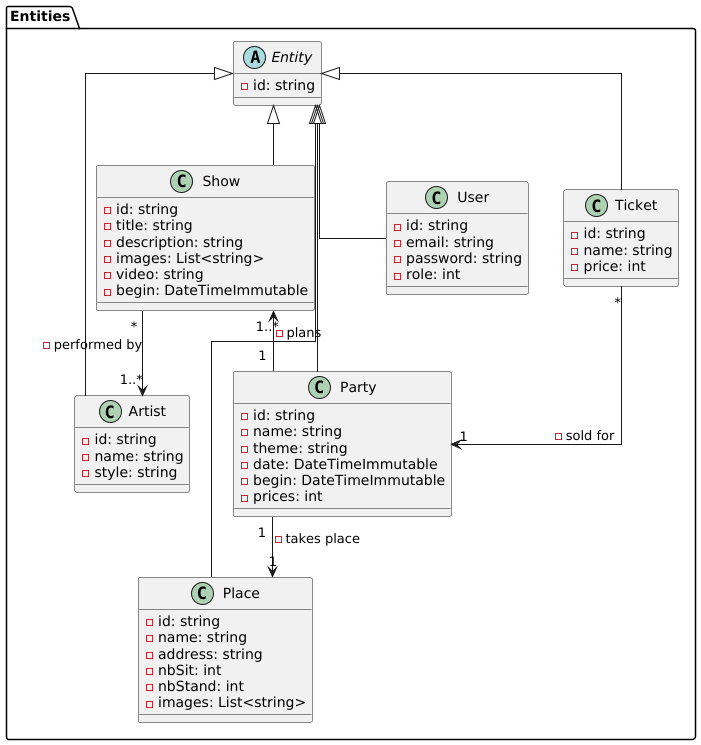

# NRV.net

## Membres du groupe :
- AUGER Benjamin
- BENCHERGUI Timothée
- BIECHY Maxime
- KHENFER Vadim

## Liens utiles :
Pour le tableau de bord :
- [Trello](https://trello.com/invite/b/671606b9a621c991bbfbdbcf/ATTI347b9a8a5d751f01d1a7904350e3f333E7D484AA/nrv)

Pour les maquettes :
- [Figma](https://www.figma.com/design/J5tfFdFLmFty3NlROJSx8Q/NRV?node-id=0-1&t=P17VER0GD6nMLpdj-1)

Le diagramme des entités : 
- 

## Installation
http://localhost:21001/shows.html
http://localhost:21001/party.html